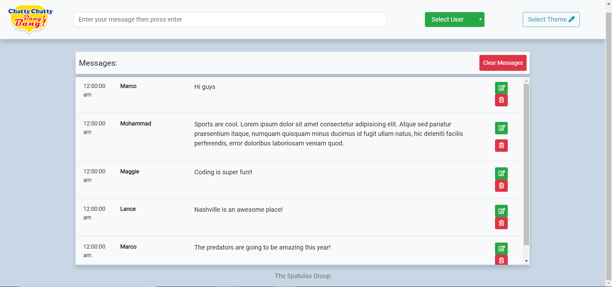
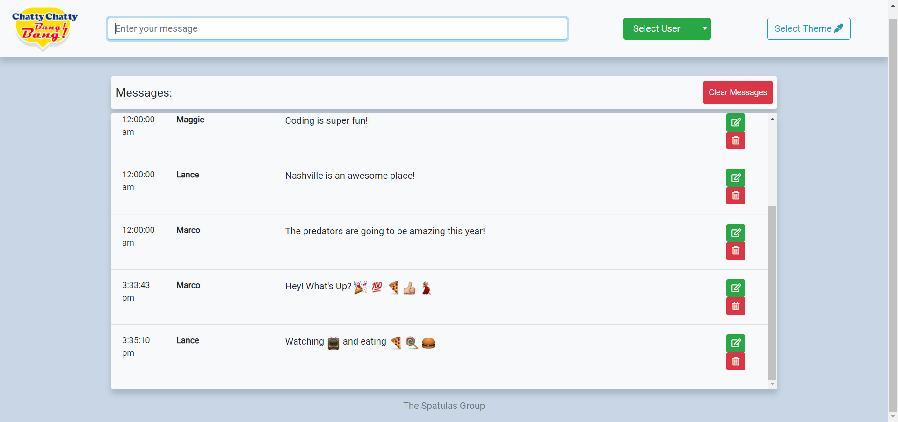
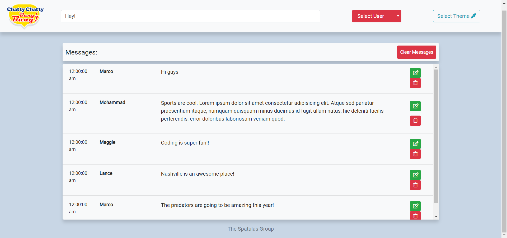
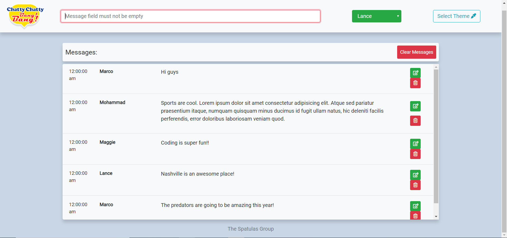
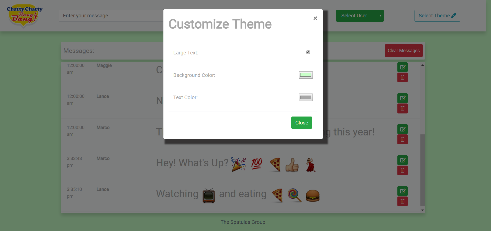
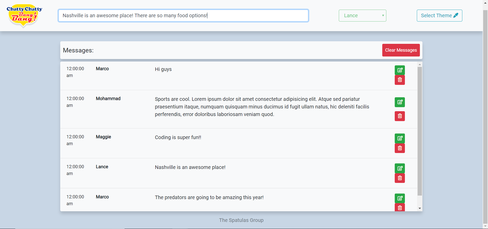
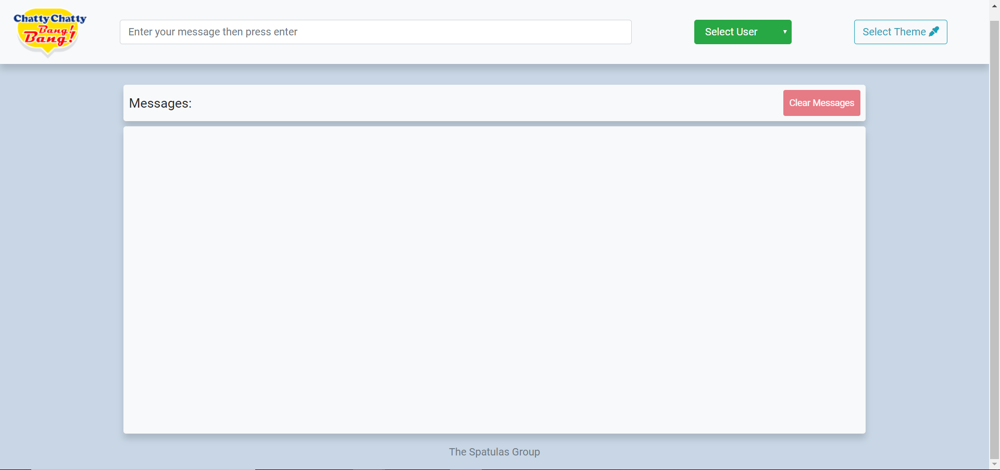
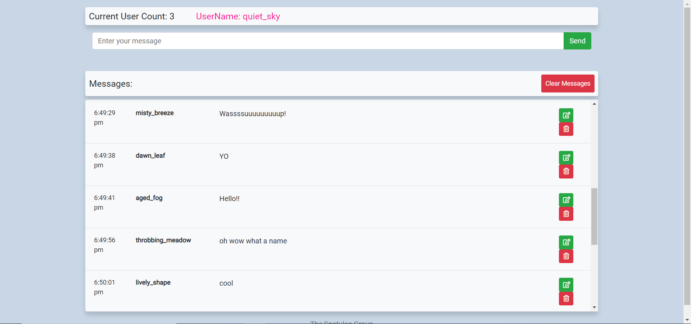

# Chatty Chatty Bang Bang Group Project

### Description
A user friendly chat application that incorporates the following features:
* Multiple Users
* Users have the ability to see the timestamp on their messages.
* Users have the ability to choose the background color, text color, and font size.
* Users have the ability to edit and delete messages.
* Users have the ability to insert emojis.

For the live chat, enter !! into text input. Users will enter the live chat and have the ability to chat with their friends.

### Technologies
* Bootstrap 4
* HTML 5
* CSS
* Javascript
* ES6 Modules

### Screenshots
Homescreen

Emoji

User Error

Message Error

Theme Modal

Edit Messages

Clear Messages

Live Chat


### How to run this project
* Use npm to install http-server in your terminal:
```sh
npm install -g http-server
```
* Run the server in your terminal
```sh
hs -p 9999
```
* Open chrome and navigate to:
```
localhost:9999
```
* Use npm to install moment.js
* Use npm to install emojify.js

### Contributors
[Maggie Leavell](https://github.com/mjleavell)
[Marco Crank](https://github.com/MCrank)
[Lance Hamilton](https://github.com/lancehamilton24)
[Mohammad Khezri](https://github.com/m-khezri)